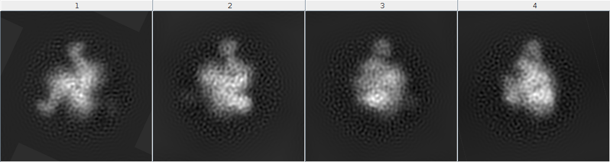
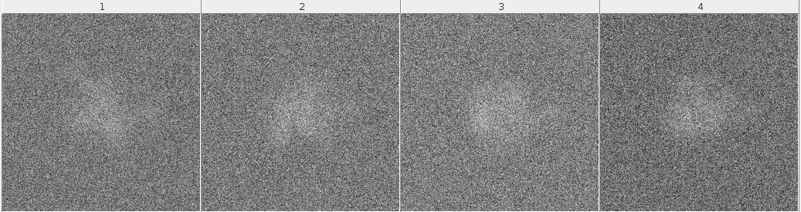
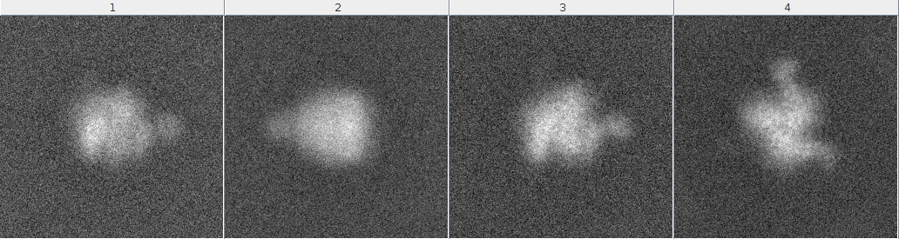
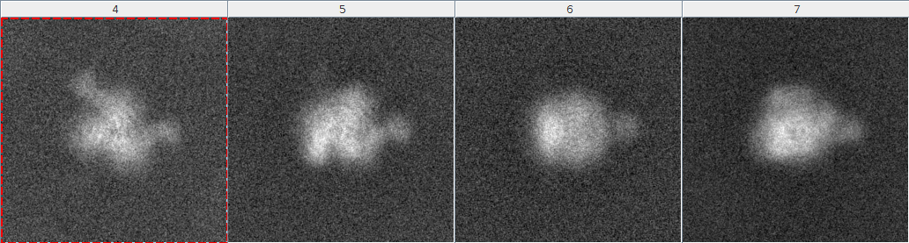
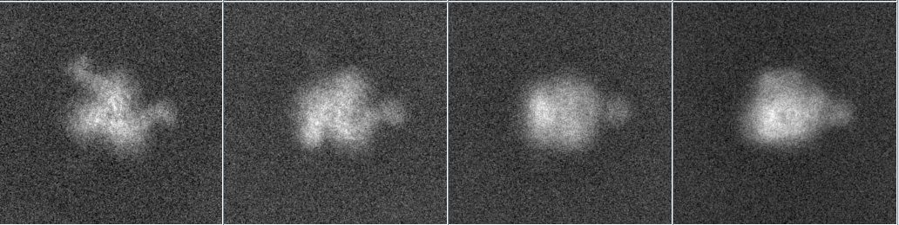
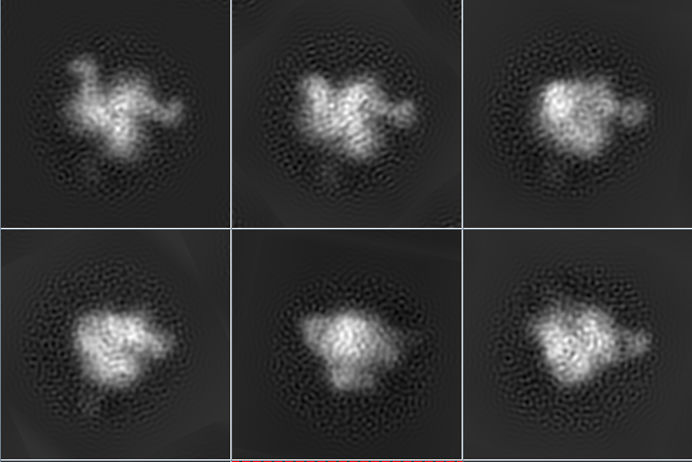
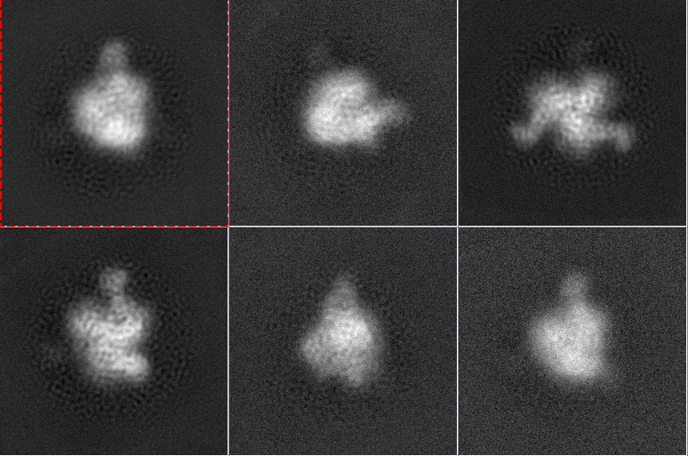
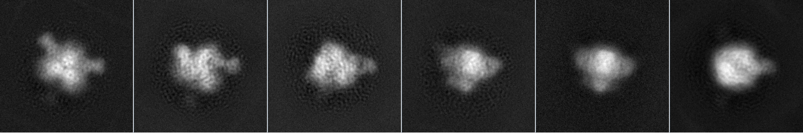
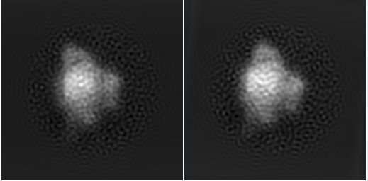

#KMeans
This repo is to cluster EM images stored in *\.xmd* files. 
The original idea is to implement the [CL2D algorithm](http://www.ncbi.nlm.nih.gov/pubmed/20362059) for further research. And this program can both conduct KMeans and divisive KMeans. 
##Program's Structure
This program consists of three classes. 
Class `Program` keeps some common elements for each KMeans procedure, like input files and input image's similarity matrix. 
Class `KMeans` implements KMeans procedure. If you run divisive KMeans, then it split the largest class after one procedure and then run KMeans with ++K. 
Class `Cluster` is the structure to keep a single class. The member `std::vector<double> corrV;` keeps similarity between each input image and this class's class average. 
First, we compute the similarity matrix which will be used in computing network based similarity between image and class average. Then, we do the KMeans, which the distance measure is network based similarity measure. After one time KMeans, we split the largest class and continue to do KMeans until reach the satisfied number of classes. 
##Experiments
####1. EMD-5780 with 4 classes
We generated 4 classes projecting [EMD-5780](http://www.ebi.ac.uk/pdbe/entry/emdb/EMD-5780) frome 4 angles, each class contains 60 images. 
4 classes without noise: 

we clustering this dataset using CL2D with those parameter: initial classes: 2, final classes: 4, using correntropy and robust option.  
And the result is:  

|         | Class 1 | Class 2 | Class 3 | Class 4 |
|---------| ------- | ------- | ------- | ------- |
|**count**|    7    |    20    |    24    |    9    |
**Obviously, it's a really bad result.** 
And using our program with initial number of classes: 2, final number of classes: 4, K-nearest neighbour: 80, we have the 100% correct result 

|           |  real Class 1 |  real Class 2 | real Class 3 | real Class 4 |
|-----------| ------- | ------- | ------- | ------- |
|**class 1**|    60    |    0    |    0    |    0    |
|**class 2**|    0    |    60    |    0    |    0    |
|**class 3**|    0    |    0    |    60    |    0    |
|**class 4**|    0    |    0    |    0    |    60    |

4 classes with SNR 1/30: 

Clustering this dataset using CL2D with the same parameter, we have the result:  

|           |  real Class 1 |  real Class 2 | real Class 3 | real Class 4 |
|-----------| ------- | ------- | ------- | ------- |
|**class 1**|    0    |    10    |    25    |    3    |
|**class 2**|    1    |    3    |    22    |    37    |
|**class 3**|    13    |    29    |    11    |    7    |
|**class 4**|    46    |    18    |    2    |    3    |

using our program with same parameter, we have the result(using **Jaccard** as network based similarity measurement): 

|           |  real Class 1 |  real Class 2 | real Class 3 | real Class 4 |
|-----------| ------- | ------- | ------- | ------- |
|**class 1**|    43    |    0    |    0    |    0    |
|**class 2**|    6    |    49    |    10    |    0    |
|**class 3**|    1    |    4    |    42    |    0    |
|**class 4**|    10    |    7    |    8    |    60    |

using **RA** as network based similarity measurement:

|           |  real Class 1 |  real Class 2 | real Class 3 | real Class 4 |
|-----------| ------- | ------- | ------- | ------- |
|**class 1**|    44    |    1    |    0    |    0    |
|**class 2**|    4    |    44    |    4    |    0    |
|**class 3**|    1    |    9    |    42    |    0    |
|**class 4**|    10    |    7    |    14    |    60    |

####2. EMD-5780 with 6 classes
Then we generate 6 classes, each class have 100 images, shows here:

#####Cluster No Noise images

our program(**Jaccard**):

|           |  real Class 1 |  real Class 2 | real Class 3 | real Class 4 | real class 5 | real class 6 |
|-----------| ------- | ------- | ------- | ------- | ------- | ------- |
|**class 1**|    100    |    0    |    0    |    0    |   0   |    0    |
|**class 2**|    0    |    100    |    0    |    0    |   0   |    0    |
|**class 3**|    0    |    0    |    100    |    0    |   0   |    0    |
|**class 4**|    0    |    0    |    0    |    100    |   0   |    0    |
|**class 5**|    0    |    0    |    0    |    0    |   100   |    0    |
|**class 6**|    0    |    0    |    0    |    0    |   0   |    100    |

#####SNR=1/3
CL2D(nref0=4, ref=6, correntropy, robust):

|           |  real Class 1 |  real Class 2 | real Class 3 | real Class 4 | real class 5 | real class 6 |
|-----------| ------- | ------- | ------- | ------- | ------- | ------- |
|**class 1**|    0    |    1    |    76    |    2    |   0   |    74    |
|**class 2**|    0    |    0    |    18    |    23    |   0   |    0    |
|**class 3**|    94    |    4    |    0    |    0    |   0   |    0    |
|**class 4**|    1    |    93    |    1    |    0    |   0   |    2    |
|**class 5**|    0    |    0    |    0    |    0    |   18   |    9    |
|**class 6**|    5    |    2    |    5    |    3    |   2   |    5    |

our program(**jaccard**):

|           |  real Class 1 |  real Class 2 | real Class 3 | real Class 4 | real class 5 | real class 6 |
|-----------| ------- | ------- | ------- | ------- | ------- | ------- |
|**class 1**|    100    |    0    |    0    |    0    |   0   |    0    |
|**class 2**|    0    |    95    |    0    |    0    |   0   |    0    |
|**class 3**|    0    |    0    |    0    |    0    |   0   |    80    |
|**class 4**|    0    |    5    |    0    |    0    |   58   |    0    |
|**class 5**|    0    |    0    |    0    |    1    |   42   |    0    |
|**class 6**|    0    |    0    |    100    |    99    |   0   |    20    |

it seems that real class5 have 2 classes. so, we look into the class 5, we really find 2 different images:

